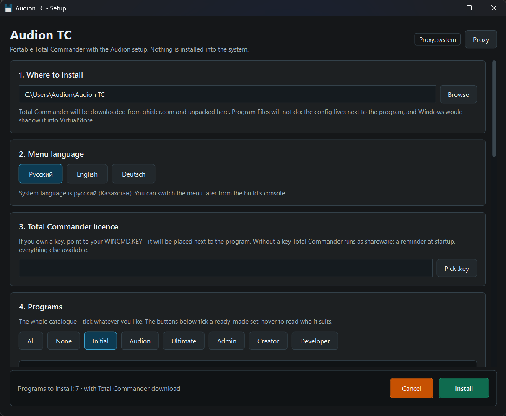

# Audion TC

<!-- audion:release -->
[](https://audion.dev/downloads/setup-for-total-commander) [](https://github.com/Tensionix/setup-for-total-commander/releases/latest) [](https://github.com/Tensionix/setup-for-total-commander/releases) [](https://github.com/Tensionix/setup-for-total-commander/blob/main/LICENSE)

**Version 1.0.0** · 2026-08-25 · 46.8 MB

- [Direct download](https://audion.dev/get/setup-for-total-commander/1.0.0/Audion_Setup_for_Total_Commander_v1.0.0_Full.zip) — unmetered, no rate limits
- [Project page](https://audion.dev/downloads/setup-for-total-commander) — every version and how to install



`SHA-256: 3a641cf9a8973f4d4cd358721eb162c501f972211e7a5116b1115478ab14df8c`

---

An **Audion** tool, published by [Tensionix](https://github.com/Tensionix).
<!-- /audion:release -->

A Total Commander setup that can be handed out: the file manager itself is not
included here and is not modified. The package holds only our own part — panels,
menus, colors, scripts, configs — and it lands on a fresh Total Commander as
whole reference files.

Eight megabytes instead of a hundred and thirty, and not one file that belongs to
someone else.

Everything you run lives in `Setup\`:

| Command | What it does |
| --- | --- |
| `Setup\Download-And-Install.cmd` | fetch Total Commander and configure it at once, Russian menu |
| `Setup\Download-And-Install-RU.cmd` | the same, English menu |
| `Setup\Install-Audion-TC.cmd` | apply to an existing installation, English menu |
| `Setup\Install-Audion-TC-RU.cmd` | the same, Russian menu |
| `Setup\Set-License-Key.cmd` | point to your own `WINCMD.KEY` through a dialog |
| `Setup\Install-Audion-TC.cmd -Check` | show what was found and what will be placed |

## Total Commander is not installed yet

`Setup\Download-And-Install.cmd` asks for a folder, takes the current version
from ghisler.com, unpacks it there and applies the setup — in one go.

Nothing third-party is needed for that: Ghisler's installer is an `exe` with a
ZIP inside, PowerShell reads it directly, and the `INSTALL.CAB` within is
unpacked by the standard `expand`. It works on any Windows from 8 onwards.

## What lies where

The root of the package holds only this file and two folders:

- `Setup\` — what the build is made **with**: the launchers and their code in
  `Setup\Scripts\`. None of it ends up in the build;
- `Payload\` — what **becomes** the build: `Bars`, `colors`, `Menus`, `Docs`,
  `licenses`, `Ware`, the icon library, plus `Run\` (the build's launchers) and
  `Scripts\` (their code).

The contents of `Payload\` used to sit in the root, and the folder looked like a
working Total Commander build — although the manager itself is not in it and by
licence cannot be. Now that is visible at a glance.

The split between `Run\` and `Scripts\` also applies inside the installed build:
`Scripts\` holds only `.ps1`, `Run\` only `.cmd`. A launcher calls the code one
level up — `call "%~dp0ps.cmd" "%~dp0..\Scripts\X.ps1"`.

## Where to install Total Commander itself

**Not into `Program Files`.** The reason is technical, not a matter of taste: the
build is portable — the config, panels, menus and programs live beside
`TOTALCMD64.EXE`, and the manager writes there every time it exits. In
`Program Files` that requires administrator rights, and without them Windows
silently redirects the write into the shadow `VirtualStore` folder, and the
settings start living a life of their own.

Install into an ordinary folder that can be written to without elevation:
`D:\Total Commander`, `C:\Apps\TC`, a flash drive — anything except
`Program Files` and `Program Files (x86)`. The Total Commander wizard asks for
the path on its very first step.

The sign that all is well: after the install the manager's folder holds a
`Wincmd.ini` with `UseIniInProgramDir=7` — that is what switches it on.

## Where it installs to

Total Commander is found on its own: the `COMMANDER_PATH` variable, the registry
entry (`HKCU`, then `HKLM`), a portable copy beside this folder. If the wrong one
is found, point at it directly:

```
Install-Audion-TC.cmd -TargetRoot "D:\Total Commander"
```

The manager has to be closed: on exit it rewrites its own config and would
overwrite the settings just applied.

## What the install does

It places `Bars`, `colors`, `Menus`, `Run`, `Scripts`, `Docs`, `Ware`,
`licenses`, `plugins` and the `Wcmicon2.dll` icon library with its description —
about 250 files.

Then it applies our reference configs whole — `Wincmd.ini`, `Usercmd.ini`,
`History.ini`. No merging key by key: what was polished in the master arrives
exactly as it is, and there is nowhere for a discrepancy to come from. The
previous configs are set aside beforehand with the date in the name — there is a
way back.

The assumption is a clean slate: nearly everyone installs onto a freshly
downloaded Total Commander rather than over their own, tuned for years. The
licence key (`WINCMD.KEY`) is left alone — that is a separate, personal file.

At the end the buttons are assembled from what is actually present in `Apps`, and
the icon size ladder for the screen scaling is applied.

## What is not in the package, and why

**Total Commander itself.** Its licence permits distributing only the unmodified
package: "modification means adding, removing or editing any files without
written permission from the author". Our build is precisely an addition of files,
so what we hand out is not the manager but the setup for it. The manager is
downloaded from Ghisler by the user.

**No files by Ghisler at all** — no language files, no help, no menus. We only
refer to them:

- the help is looked for where the installer put it: in the root, or, if the
  distribution was unpacked by hand, in `e\` (English) or `d\` (German);
- the Russian menu is paired with the stock `Language\WCMD_RUS.LNG` if it is
  present; for the English one nothing is written — English is Total Commander's
  default anyway.

**The licence key.** It is personal. `Set-License-Key.cmd` opens a file dialog
and places your file into the manager's folder. Without a key Total Commander
runs as fully functional shareware with a reminder window.

**Notepad++ and the programs for `Apps`.** All of it is downloaded through the
`Scripts\apps_map.ini` map from the `Run\Launcher.cmd` console — from the
authors' own sites, where the licence lives too.

## Plugins

Ten of them, 37 MB, sit in `Payload\plugins` and are installed along with
everything else:

| Viewers (`WLX64`) | Columns (`WDX64`) |
| --- | --- |
| SVGView — SVG and SVGZ | MediaInfo — everything about media files |
| TCSumatraPDF — PDF, DjVu, EPUB, FB2, CHM | Exif — photographs and cameras |
| Office2007 — DOCX, XLSX, PPTX | xPDFSearch — searching inside PDF |
| ICLView — icons in EXE, DLL, ICL | ShellDetails — Windows Explorer fields |
| DirSizeCalc Charts — folder size as a chart | DirSizeCalc — folder size as a column |

They are registered in our own `Wincmd.ini`, which is applied whole — so they
connect themselves, together with the build. The files live in `plugins\`.

Their distribution terms differ. Redistribution as part of a package is allowed
by: Exif (MIT), MediaInfo (BSD), xPDFSearch (GPL v2), Office2007 (CPOL 1.02),
DirSizeCalc and DirSizeCalc Charts (copyrighted freeware). Declared free for
non-commercial use only, without separate permission to redistribute as part of a
package: ICLView, TCSumatraPDF, SVGView. ShellDetails states no terms in its
documentation at all.

`CudaLister` has been removed from the build: the stock Total Commander viewer
replaced it — that one does not bring the manager down out of nowhere.

## About the icon library

`Wcmicon2.dll` is not a Ghisler file but a well-known community set: Total
Commander's stock icons were drawn in the nineties and look coarse on today's
screens. The stock library is not deleted during installation but set aside as
`Wcmicon2.dll.ghisler` — it can be brought back at any time.

## Menus

Two files, identical in content:

- `Menus\WCMD_AUDION_RUS.MNU` — Russian;
- `Menus\WCMD_AUDION_ENG.MNU` — English.

The English one was not assembled by guesswork: the Total Commander command
captions were taken from Ghisler's own English menu and his `TOTALCMD.INC`, and
the Windows entries are named as they are named in Windows itself — "Task
Scheduler", "Performance Monitor", "Disk Cleanup", "Programs and Features".

The Russian names were checked against Microsoft too, and it turned out ours said
"Планировщик заданий" instead of "Планировщик задач", "Монитор
производительности" instead of "Системный монитор", "Параметры Интернета"
instead of "Свойства браузера". Fixed.

## Verified

On a clean Total Commander 11.58, downloaded and unpacked by the package itself:
283 files placed, the reference `Wincmd.ini` / `Usercmd.ini` / `History.ini`
applied, ten plugins connected, buttons and sizes assembled. The result matches
the reference build (Audion TC Base) byte for byte in menus, commands, colors and
scripts; only the `Apps` folder (programs are fetched from the console) and the
licence differ. `TOTALCMD64.EXE`, the language files and Ghisler's help are
untouched.

## Documentation

After the install all documentation lives in the build's folder, in `Docs\` (the
same files are in `Payload\Docs\` of this package):

- [`USER_GUIDE.md`](Payload/Docs/USER_GUIDE.md) — the control console: updating
  programs and plugins, backing up settings, preparing for distribution;
- [`README_Shortcuts.md`](Payload/Docs/README_Shortcuts.md) — our keyboard
  shortcuts beyond the stock ones;
- [`PROJECT.md`](Payload/Docs/PROJECT.md) — how the build works: the decisions
  that are not visible from the code in a minute — editors, themes, the loader,
  icons, the installer;
- [`fastfetch.md`](Payload/Docs/fastfetch.md), [`bottom.md`](Payload/Docs/bottom.md) —
  the resident utilities;
- [`Portable-Apps.md`](Payload/Docs/Portable-Apps.md) — how the programs in `Apps`
  are portable by their own means and what is configured in advance (honestly and
  openly);
- [`mpv.md`](Payload/Docs/mpv.md) — the mpv player and its config, line by line;
- `Docs\PDF\` — the same documents as PDF, for reading without Markdown.
